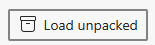

# KlaxGen Extension for Microsoft Edge

This extension is not published. Please follow these instructions to install the KlaxGen exception in Microsoft Edge.

Note: the extension might (should) work with Google Chrome, but is untested.

1. Go to https://github.com/jfbilodeau/KlaxGen
2. Download the code as a ZIP file by clicking on `Code`, then `Download ZIP`

3. Extract the ZIP file on your machine
4. Open Microsoft Edge
5. Navigate to `edge://extensions/`

6. Activate the `Developer mode` option

7. Select `Load unpacked`

8. Navigate to the directory where you unzipped KlaxGen and click `Select Folder`
9. The extensions should now be installed.

10. (Optional) Click on the `...` button beside the name of the extension and select `Show in toolbar`

11. KlaxGen is now ready to be used!